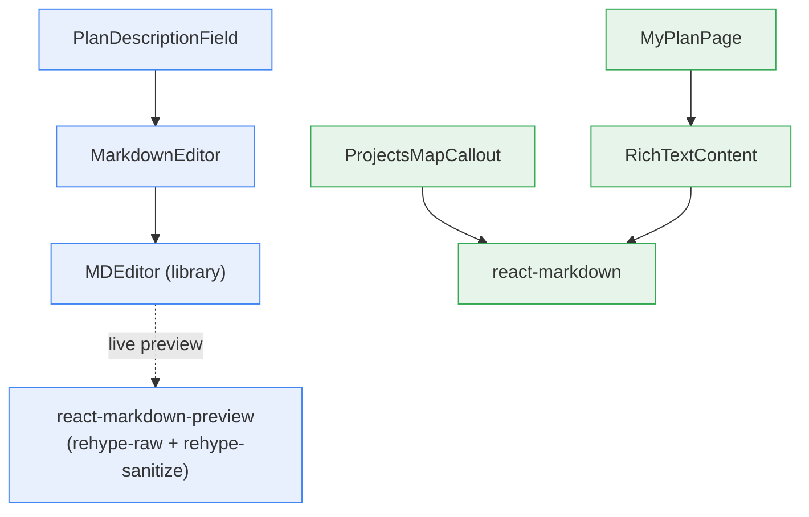
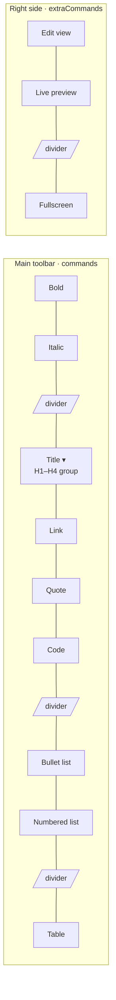
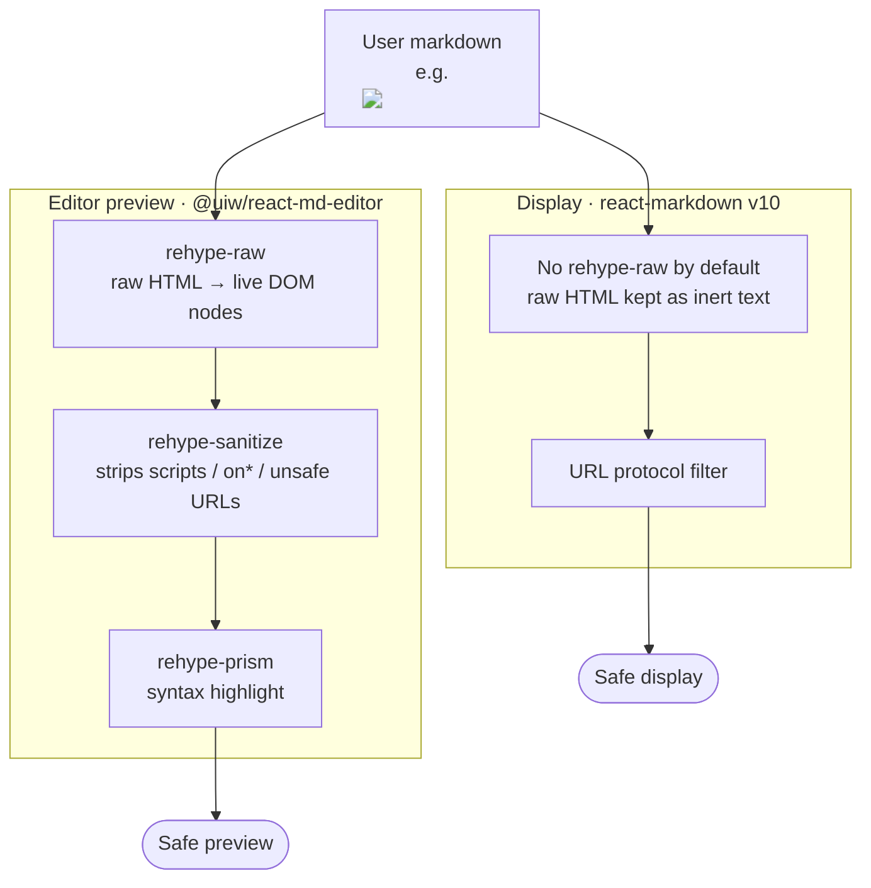

# Plan Description — Editor & Rendering

How a plan's `description` is authored, stored, sanitized, and displayed, plus
the formatting options available to users.

The description is an optional Markdown string on a plan. It is written with a
rich Markdown editor and rendered back as safe HTML wherever the plan is shown.

---

## 1. End-to-end data flow

```mermaid
flowchart LR
    U([User]) -->|types markdown| ED[MarkdownEditor<br/>@uiw/react-md-editor]
    ED -->|onChange string| PF[PlanForm state<br/>description]
    PF -->|onSubmit| API[(Backend API)]
    API -->|persists| DB[(plans.description<br/>text · nullable)]
    DB -->|GET plan| RTC[RichTextContent<br/>react-markdown]
    RTC -->|safe HTML| V([Reader])

    subgraph AUTHOR [Authoring]
        ED
        PF
    end
    subgraph DISPLAY [Display]
        RTC
    end
```

The value passed around is always a **raw Markdown string** — never HTML. HTML
only ever exists transiently inside the two rendering libraries, and both are
configured so that untrusted markup cannot execute.

---

## 2. Component map



| Component | File | Role |
|---|---|---|
| `PlanDescriptionField` | `components/form/PlanDescriptionField.tsx` | Label + hint + editor wrapper used inside the plan form |
| `MarkdownEditor` | `components/shared/MarkdownEditor.tsx` | Configures the `@uiw/react-md-editor` instance (toolbar, sizing, sanitization) |
| `RichTextContent` | `components/shared/RichTextContent.tsx` | Renders a stored Markdown string for display (`react-markdown`) |
| `MyPlanPage` | `portal-plans/MyPlanPage.tsx` | Shows the saved description via `RichTextContent` |
| `ProjectsMapCallout` | `components/ProjectsMapCallout.tsx` | Renders a shortened project description via `react-markdown` |

---

## 3. The editor

`MarkdownEditor` wraps `MDEditor` and customizes it in three ways.

### 3.1 Custom toolbar

The default library toolbar is replaced with a curated set of commands. Icons
are enlarged to `18px` by cloning the library's own icon elements (`enlarge()`).



- **Main commands** (`toolbarCommands`): bold, italic, a Title dropdown grouping
  H1–H4, link, quote, code, bullet list, numbered list, table.
- **Extra commands** (`extraToolbarCommands`, right-aligned): edit-only view,
  live-preview toggle, fullscreen.
- Everything else the library ships (image, checked-list, help, strikethrough,
  etc.) is intentionally **omitted** to keep the toolbar focused.

### 3.2 Layout

- `data-color-mode="light"` — forces light theme regardless of OS setting.
- `height="100%"`, `minHeight={350}`, `visibleDragbar={false}`.
- CSS overrides live in `MarkdownEditor.css`, scoped under `.markdown-editor`.
  Notably it **restores list markers** in the preview pane, because Tailwind's
  `@tailwind base` (Preflight) resets `ul, ol { list-style: none }`.

### 3.3 Supported formatting

What a user can produce, and how it renders:

| Markdown | Produces |
|---|---|
| `**bold**`, `*italic*` | Bold / italic text |
| `# … ####` | Headings H1–H4 |
| `[label](https://…)` | Link (unsafe URL schemes stripped) |
| `> quote` | Blockquote |
| `` `code` ``, ```` ``` ```` | Inline / fenced code (syntax highlighted in preview) |
| `- item` / `1. item` | Bullet / numbered list |
| `\| a \| b \|` | Table |

---

## 4. Security — sanitization

This is the important part. The two libraries have **opposite defaults** for
raw HTML, so they are treated differently.



### 4.1 Why the editor needs `rehype-sanitize`

`@uiw/react-md-editor`'s preview pane runs Markdown through **`rehype-raw`** by
default, which turns any embedded HTML into real DOM nodes with **no filtering**.
Without a sanitizer, input like:

```markdown
Nice plan 
```

would build a live `` whose `onerror` handler executes in the reader's
session — stored XSS. We close this by passing `rehype-sanitize` through the
editor's `previewOptions`:

```tsx
previewOptions={{ rehypePlugins: [[rehypeSanitize]] }}
```

`rehype-sanitize` runs **after** `rehype-raw` (so it sees the real nodes) and
**before** `rehype-prism` (so code-block highlight classes survive). It strips
`<script>`, `on*` event-handler attributes, and `javascript:`-style URLs while
keeping normal formatting.

> Package: `rehype-sanitize@6` (added to `package.json`). Default schema is
> GitHub's; a side effect is that heading `id`s are dropped, so in-preview
> heading anchor links do not resolve. Extend `defaultSchema` if that matters.

### 4.2 Why `RichTextContent` does not

`react-markdown` (v10) is **safe by default**: it does not render raw HTML at
all (no `rehype-raw` unless you add it) and strips dangerous URL protocols. The
same `` string is rendered as inert text. No extra plugin needed.

> ⚠️ Footgun: do **not** add `rehype-raw` to `RichTextContent` or
> `ProjectsMapCallout` without also adding `rehype-sanitize` — that would
> reintroduce the stored-XSS hole. This is noted in the `RichTextContent`
> docstring.

### 4.3 Summary

| Surface | Library | Raw HTML default | Mitigation |
|---|---|---|---|
| Editor preview | `@uiw/react-md-editor` | **Renders it** (`rehype-raw`) | `rehype-sanitize` via `previewOptions` |
| `RichTextContent` | `react-markdown` | Ignored (inert text) | Safe by default |
| `ProjectsMapCallout` | `react-markdown` | Ignored (inert text) | Safe by default |

---

## 5. File reference

```
src/
├── components/
│   ├── shared/
│   │   ├── MarkdownEditor.tsx     # editor config + sanitization
│   │   ├── MarkdownEditor.css     # scoped style overrides
│   │   └── RichTextContent.tsx    # display renderer (safe by default)
│   └── ProjectsMapCallout.tsx     # shortened description on the map
└── portal-plans/
    ├── components/form/
    │   ├── PlanDescriptionField.tsx  # label + hint + editor
    │   └── PlanForm.tsx              # owns `description` state
    ├── MyPlanPage.tsx                # renders saved description
    └── plan-description-editor.md    # this document
```
